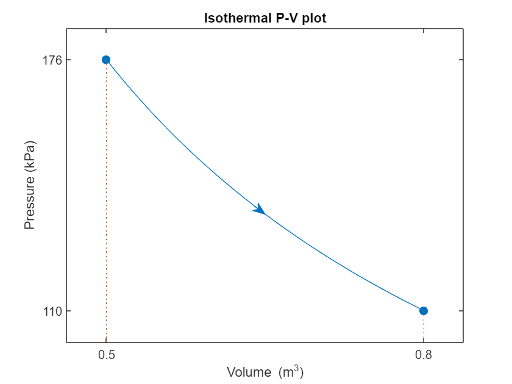
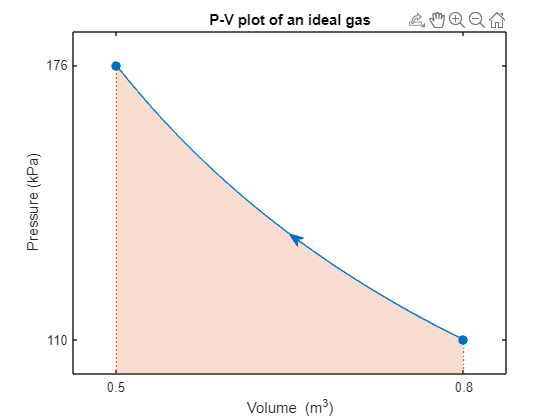
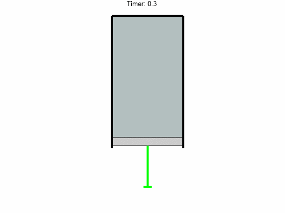
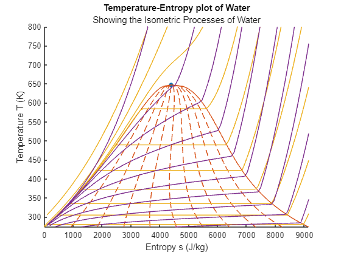
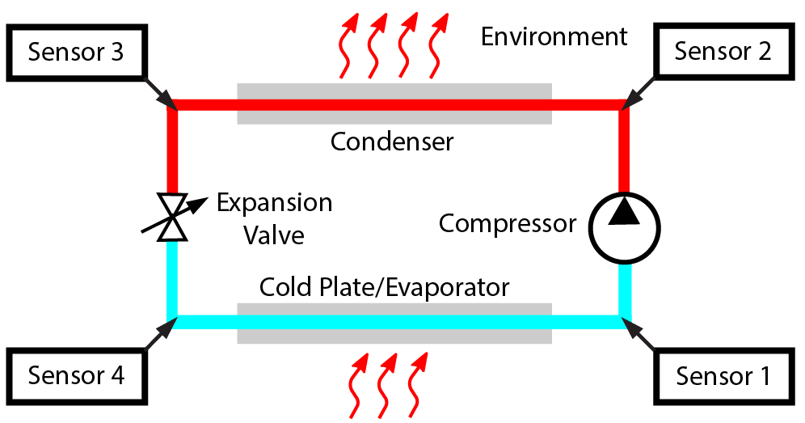

# Thermodynamics

 or 

**Curriculum Module**

_Created with R2024a. Compatible with R2024a and later releases._

# Information

This curriculum module contains interactive [MATLAB® live scripts](https://www.mathworks.com/products/matlab/live-editor.html) that teach fundamental concepts and basic terminology related to introductory thermodynamics. Topics addressed include units, the first and second laws of thermodynamics, state variables, work, and the components of a refrigeration cycle. 

## Background

You can use these live scripts as demonstrations in lectures, class activities, or interactive assignments outside class. This module consists of several interactive live scripts intended to introduce or deepen student understanding of thermodynamic concepts, including working with data tables and reading thermodynamic plots. Two additional scripts are included for instructors or students who want to go beyond the included material by installing CoolProp or building their own refrigerator model. 

The instructions inside the live scripts will guide you through the exercises and activities. Get started with each live script by running it one section at a time. To stop running the script or a section midway (for example, when an animation is in progress), use the  Stop button in the **RUN** section of the **Live Editor** tab in the MATLAB Toolstrip.

Solutions are available upon instructor request. Contact the [MathWorks online teaching team](mailto:%20onlineteaching@mathworks.com) if you would like to request solutions or have a question.

## Related Courseware Modules
-  [**Calculus: Integrals** ](https://www.mathworks.com/matlabcentral/fileexchange/105740-calculus-integrals)is available on  or  or [GitHub](https://github.com/MathWorks-Teaching-Resources/Calculus-Integrals)  
## Prerequisites

These scripts assume background knowledge of common thermodynamic terminology covered in secondary education, such as temperature, pressure, kinetic energy, and potential energy. Some scripts also require fluency with basic integral calculus. There is minimal MATLAB knowledge required for FirstLaw, SecondLaw and StatePlots, but you could use [MATLAB Onramp](https://matlabacademy.mathworks.com/details/matlab-onramp/gettingstarted) as a resource to acquire familiarity with live scripts and MATLAB syntax. More familiarity with MATLAB is required for CreatePVplots, CalculateWork, and Model\_Fridge, as those are designed in Code Visible format. Familiarity with Simulink at the level of [Simulink Onramp](https://matlabacademy.mathworks.com/details/simulink-onramp/simulink) may be helpful for Model\_Fridge as well.

For those interested in additional coding, SetUpCoolProp includes instructions for installing and accessing CoolProp. BuildRefrigerator walks through a project to build a refrigerator model in Simulink out of standard component blocks. BuildRefrigerator requires [Simulink Onramp](https://matlabacademy.mathworks.com/details/simulink-onramp/simulink), at a minimum. If possible, [Simscape Onramp](https://matlabacademy.mathworks.com/details/simscape-onramp/simscape) would be helpful as well. Students are expected to find and insert specified blocks, connect blocks, edit block parameters, rename blocks, copy and paste subsystems, run simulations, and explore the output.

## Getting Started

**On MATLAB Online:**

Use the  link to download the module. You will be prompted to log in or create a MathWorks account. The project will be loaded, and you will see README.mlx laying out the contents of the repository.

**On Desktop:**

Ensure you have all the required products (listed below) installed. If you need to include a product, add it using the Add\-On Explorer. To install an add\-on, go to the **Home** tab and select   **Add-Ons** > **Get Add-Ons**. Then open Thermodynamics.prj to set up the project. The project will be loaded, and you will see README.mlx laying out the contents of the repository.

**Working through the module:**

Get started with each topic by clicking the link to open the live script. The instructions inside each live script will walk you through the live script and related functions.

## Products

MATLAB®, Simscape™, Simulink®, Simulink® Real\-Time™, Stateflow®, Symbolic Math Toolbox™, Image Processing Toolbox™

MATLAB and Symbolic Math Toolbox are used throughout. Simulink and Simscape are used in <samp>Model_Fridge.mlx</samp> and <samp>BuildRefrigerator.mlx</samp>. Image Processing Toolbox is used in <samp>Model_Fridge.mlx</samp>. Tools from Simulink, Simulink Real\-Time, and Stateflow are used in <samp>CalculateWork.mlx</samp>.

# Scripts
|      |      |      |      |
| :-- | :-- | :-- | :-- |
| **Topic**    | **Summary**    | **Learning Objectives**   In this script, students will...    | **Mode**     |
|  **First Law of Thermodynamics** in    [**FirstLaw.mlx** ](https://matlab.mathworks.com/open/github/v1?repo=MathWorks-Teaching-Resources/Thermodynamics&project=Thermodynamics.prj&file=Scripts/FirstLaw.mlx)      Photo credit: [Nina Aldin Thune](https://matlab.mathworks.com/open/github/v1?repo=MathWorks-Teaching-Resources/Thermodynamics&project=Thermodynamics.prj&file=Scripts/FirstLaw.mlx)    | This script introduces the first law of thermodynamics, focusing on units, energy, systems, and conservation laws.    | \* Express various forms of energy in terms of fundamental units   \* Apply the conservation of mass in simple, conceptual situations   \* Identify systems with open and closed control volumes   \* Apply the first law of thermodynamics    | Code Hidden     |
|  **Standard Thermodynamics Language** in [**CreatePVplots.mlx**](https://matlab.mathworks.com/open/github/v1?repo=MathWorks-Teaching-Resources/Thermodynamics&project=Thermodynamics.prj&file=Scripts/CreatePVplots.mlx)        | This script investigates pressure\-volume (PV) diagrams and their relationship to state equations in a closed system.    | \* Identify keywords including isothermal, isobaric, and isochoric, and translate word problems into thermodynamic terminology   \* Identify and state necessary assumptions to express a thermodynamic relationship    | Code Visible     |
| **Calculate Work from P\-V plots** in [**CalculateWork.mlx**](https://matlab.mathworks.com/open/github/v1?repo=MathWorks-Teaching-Resources/Thermodynamics&project=Thermodynamics.prj&file=Scripts/CalculateWork.mlx)        | This script introduces computing the work done by a system using analysis of its PV plot.    | \* Identify positive, negative, and zero work from a P\-V plot without computing the value   \* Compute work in constant pressure, constant volume, and integrable P\-V plots   \* Compare various state equations both to each other and to tabular data   \* Compute the work done by a piston modeled in Simulink    | Code Visible     |
|  **Second Law of Thermodynamics** in [**SecondLaw.mlx**](https://matlab.mathworks.com/open/github/v1?repo=MathWorks-Teaching-Resources/Thermodynamics&project=Thermodynamics.prj&file=Scripts/SecondLaw.mlx)        |  | \* Identify thermal sources, sinks, and reservoirs   \* Compute thermal efficiency   \* Reflect on the second law of thermodynamics   \* Use the universe as a system of reference for determining thermodynamic flows    | Code Hidden     |
|  **Properties of Pure Substances** in [**StatePlots.mlx**](https://matlab.mathworks.com/open/github/v1?repo=MathWorks-Teaching-Resources/Thermodynamics&project=Thermodynamics.prj&file=Scripts/StatePlots.mlx)        | This script introduces state diagrams and temperature\-entropy plots.    | \* Investigate the standard shapes of state diagrams   \* Investigate Temperature/Entropy plots for several pure substances, including water, R134a, and ammonia   \* Identify liquid, gas, two\-phase, and supercritical states of matter on a temperature\-entropy plot    | Code Hidden     |
| **Explore a Refrigeration Mode**l in [**Model\_Fridge.mlx**](https://matlab.mathworks.com/open/github/v1?repo=MathWorks-Teaching-Resources/Thermodynamics&project=Thermodynamics.prj&file=Scripts/Model_Fridge.mlx)       | This project applies the thermodynamic concepts to an everyday example using a Simulink model.    | \* Apply understanding about thermodynamic cycles to model a refrigerator   \* Perform unit conversions required to extract values from a database and use them in a model   \* Read and interpret thermodynamic plots   \* Create informative plots based on thermodynamic sensor data    | Code Visible     |
|      |      |      |       |

# Additional Scripts:
|      |      |      |
| :-- | :-- | :-- |
| **Script**    | [**SetUpCoolProp.mlx**](https://matlab.mathworks.com/open/github/v1?repo=MathWorks-Teaching-Resources/Thermodynamics&project=Thermodynamics.prj&file=Scripts/SetUpCoolProp.mlx)    | [**BuildRefrigerator.mlx**](https://matlab.mathworks.com/open/github/v1?repo=MathWorks-Teaching-Resources/Thermodynamics&project=Thermodynamics.prj&file=Scripts/BuildRefrigerator.mlx)      |
| **Description**    | A guide to installing and testing the functionality CoolProp from MATLAB.    | Using Simulink and the capabilities of the Simscape Two\-Phase Fluid libraries, build and test a complete refrigerator.     |
|      |      |       |

# <u>If you have questions:</u>

Solutions are available upon instructor request. Contact the [MathWorks online teaching team](mailto:%20onlineteaching@mathworks.com) if you would like to request solutions or have a question.

Copyright 2023 The MathWorks, Inc.

